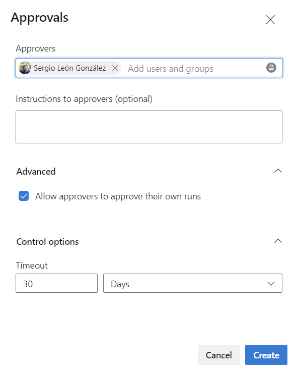
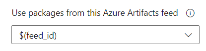
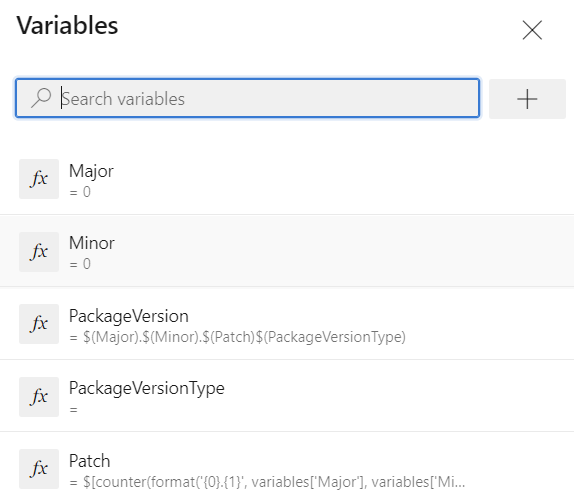
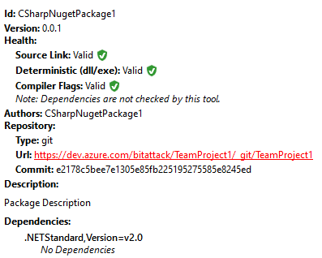

# Introduction

A [cookiecutter](https://github.com/cookiecutter/cookiecutter) template for a NuGet package running CI/CD in Azure DevOps or GitHub and published in an Azure DevOps feed.

# Usage

```bash
pip install cookiecutter
cookiecutter https://github.com/panicoenlaxbox/cookiecutter-csharpnugetpackage
```

## Parameters

| Parameter | Description |
| -------------- | ------------------------------------------------------------ |
| `package_name` | Package name. |
| `organization_name` | Azure DevOps organization name. |
| `team_project_name` | Azure DevOps team project name. Optional if you are using an [organization-scoped feed](https://learn.microsoft.com/en-us/azure/devops/artifacts/feeds/project-scoped-feeds). |
| `feed_name` | Azure DevOps project feed name. |
| `workflow` | GitHub or Azure DevOps. Indicates where the CI/CD will be executed. |

## Code formatting
A `.editorconfig` file is provided. In addition, a git pre-commit hook is set up to run `dotnet format` on every commit.

In order to ensure [Husky.net](https://alirezanet.github.io/Husky.Net/) is installed, you must perform a couple of steps:

```bash
dotnet tool restore
git init
dotnet husky install
```

## Testing

Also, via a dotnet tool, you can generate your code coverage.

```bash
dotnet test /p:CollectCoverage=true /p:CoverletOutputFormat=cobertura /p:CoverletOutput=..\TestResults\Coverage\
```

Previous command will generate `coverage.cobertura.xml` file in the specified folder.

Now, we can run the following command to generate a HTML file with our testing coverage.

```bash
dotnet reportgenerator -reports:tests\TestResults\Coverage\**\*.cobertura.xml -targetdir:tests\TestResults\reportgenerator -reporttypes:HtmlInline_AzurePipelines
```

`TestResults` folder is excluded also in the git repository.

```bash
# MSTest test Results
[Tt]est[Rr]esult*/
```

## Deploy

### Azure DevOps

You must create, in addition to the team project, a feed and an environment with resource of type None and with manual approval.



With everything ready, you can now create the pipeline using the `azure-pipelines.yml` file, where you will have to select the id of the feed and write the right environment name.


To retrieve the feed id, there is not easy way, but you can get it using the task details, for example:



Now, you can set the right value in `$(feed_id)` variable.

The pipeline needs the following variables ir order to run successfully:

| Name                 | Value                                                        |
| -------------------- | ------------------------------------------------------------ |
| `Major`              | 0                                                            |
| `Minor`              | 0                                                            |
| `PackageVersionType` |                                                              |
| `Patch`              | `$[counter(format('{0}.{1}', variables['Major'], variables['Minor']), 0)]` |
| `PackageVersion`     | `$(Major).$(Minor).$(Patch)$(PackageVersionType)`            |

> The idea comes from https://www.koskila.net/fun-with-azure-devops-nuget-package-versioning/

`PackageVersionType` should be empty or something like `-value` (hyphen included), more info at https://docs.microsoft.com/en-us/nuget/create-packages/prerelease-packages. 

> Currently, if you don't supply any value and the triggered branch is not `main`, the variable will be set to `-alpha`.

You should allow to modify in each pipeline execution (*Let users override this value when running this pipeline*), the values of `Major`, `Minor` and `PackageVersionType` variables to control SEMVER package version manually when required.



#### Required extensions

https://marketplace.visualstudio.com/items?itemName=Palmmedia.reportgenerator

#### Permissions

You must assign the Contributor permission on the feed to the special user `<team_project_name> BuildService` in order to publish the package to the feed.

### GitHub

In case of GitHub, you must supply a secret in `NUGET_PASSWORD` with a valid PAT.

This time, the versioning will be done by taking the value from the `.csproj` file.

## Source Link

From a client application, you can debug your package in Visual Studio enabling Source Link support. More info at https://lurumad.github.io/using-source-link-in-net-projects-and-how-to-configure-visual-studio-to-use-it

The following configuration has to be done in Visual Studio.

- Enable Just My Code (disabled)
- Enable Source Link support (enabled)

To support source link, the following has been added to the `.csproj` file.

```xml
<PropertyGroup>
    <DebugType>embedded</DebugType>
    <DebugSymbols>true</DebugSymbols>
    <PublishRepositoryUrl>true</PublishRepositoryUrl>
    <ContinuousIntegrationBuild Condition="'$(TF_BUILD)' == 'true'">True</ContinuousIntegrationBuild>
    <Deterministic>true</Deterministic>
    <EmbedUntrackedSources>true</EmbedUntrackedSources>
    <Version>1.0.0</Version>
</PropertyGroup>
```

```xml
<PackageReference Include="Microsoft.SourceLink.AzureRepos.Git" Version="1.1.1">
	<PrivateAssets>all</PrivateAssets>
	<IncludeAssets>runtime; build; native; contentfiles; analyzers; buildtransitive</IncludeAssets>
</PackageReference>
```

If instead of Azure DevOps it had been GitHub, the changes would be these:

```xml
<ContinuousIntegrationBuild Condition="'$(GITHUB_ACTIONS)' == 'true'">True</ContinuousIntegrationBuild>
```

```xml
<PackageReference Include="Microsoft.SourceLink.GitHub" Version="1.0.0">
	<PrivateAssets>all</PrivateAssets>
	<IncludeAssets>runtime; build; native; contentfiles; analyzers; buildtransitive</IncludeAssets>
</PackageReference>
```

Finally, you should see something similar to this in your package, once published.

You can use [NuGet Package Explorer](https://apps.microsoft.com/store/detail/nuget-package-explorer/9WZDNCRDMDM3)

